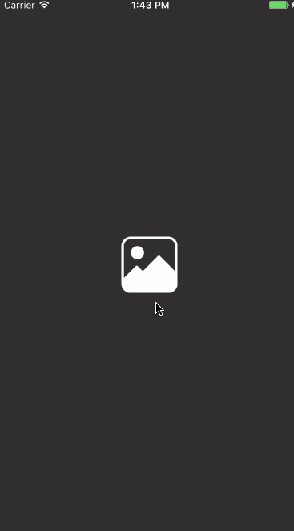

# WCLImagePickerController


[](http://cocoapods.org/pods/WCLImagePickerController)
[](http://cocoapods.org/pods/WCLImagePickerController)
[](http://cocoapods.org/pods/WCLImagePickerController)

`WCLImagePickerController`是一个自定义的图片选择器



# Demo

可以通过[Appetize.io](https://appetize.io/app/hue1a1gmunhh46dtcxuj8ycfd4?device=iphone5s&scale=75&orientation=portrait&osVersion=9.3)运行我的Demo，非常方便~

# **Features**

- [x] 支持多选图片
- [x] 支持图片预览
- [x] 可以高度自定义界面，包括颜色和其他功能
- [x] 支持拍照功能
- [x] 支持本地化（中、英）

# 安装

必须iOS 8.0+ Swift3

## CocoaPods

如果没有安装你可以用下面的命令安装[CocoaPods](http://cocoapods.org)：

```shell
$ gem install cocoapods
```

使用CocoaPods将`WCLImagePickerController`添加到您的`Xcode`项目，在`Podfile`中添加一下代码：

```ruby
source 'https://github.com/CocoaPods/Specs.git'
platform :ios, '8.0'
use_frameworks!

pod 'WCLImagePickerController'
```

然后，运行以下命令：

```shell
$ pod install
```

# 使用

首先因为权限问题需要加入照片权限和摄像头的权限：

在项目的`info.plist`添加一下字段

`NSPhotoLibraryUsageDescription`和`NSCameraUsageDescription`

可以下载项目查看demo：

```swift
// 推出WCLImagePickerController
WCLImagePickerController.present(inVC: self, delegate: self)

// 实现代理
func wclImagePickerCancel(_ picker: WCLImagePickerController) {
    picker.dismiss(animated: true, completion: nil)
}
    
func wclImagePickerComplete(_ picker: WCLImagePickerController, imageArr: [UIImage]) {
   picker.dismiss(animated: true, completion: nil)
}
    
func wclImagePickerError(_ picker: WCLImagePickerController, error: WCLError) {
    let al = UIAlertController.init(title: nil, message: error.lcalizable, preferredStyle: .alert)
    let cancel = UIAlertAction.init(title: WCLImagePickerBundle.localizedString(key: "取消"), style: .cancel, handler: nil)
    al.addAction(cancel)
    self.vc?.present(al, animated: true, completion: nil)
 }
```

# 自定义

以下属性都是可以自定义的，下面是一下默认的配置

```swift
public struct WCLImagePickerOptions {
    //字体设置，默认苹方字体
    static var fontLightName: String   = "PingFangSC-Light"
    static var fontRegularName: String = "PingFangSC-Regular"
    static var fontMediumName: String  = "PingFangSC-Medium"
    
    //MARK: 图片选择器的选项
    //是否需要拍照功能
    static var needPickerCamera: Bool  = true
    //相册页每行的照片数，默认每行3张
    static var photoLineNum: Int       = 3
    //相册选择页照片的间隔，默认3，最小为2
    static var photoInterval: Int      = 3
    //相册选择器最大选择的照片数
    static var maxPhotoSelectNum: Int  = 9
    //是否显示selectView
    static var isShowSelecView: Bool   = true
    
    //MARK: launchImage的配置
    //相册启动图片和启动颜色，二选一，launchImage优先级高
    static var launchImage: UIImage?   = nil
    //没有设置默认用imageTintColor
    static var launchColor: UIColor?   = nil
    
    //MARK: 状态栏的样式
    static var statusBarStyle: UIStatusBarStyle = .lightContent
    
    //MARK: 图片的配置
    static var imageBuffer: UIImage?        = WCLImagePickerBundle.imageFromBundle("image_buffer")
    static var ablumSelectBackGround: UIImage?   = WCLImagePickerBundle.imageFromBundle("image_ablumSelectBackGround")
    static var cameraImage: UIImage?   = WCLImagePickerBundle.imageFromBundle("image_camera")
    static var pickerArrow: UIImage?   = WCLImagePickerBundle.imageFromBundle("image_pickerArrow")
    static var pickerDefault: UIImage? = WCLImagePickerBundle.imageFromBundle("image_pickerDefault")
    static var selectPlaceholder: UIImage? = WCLImagePickerBundle.imageFromBundle("image_selectPlaceholder")
    
    //MARK: 颜色的配置
    static var tintColor: UIColor       = UIColor(red: 49/255, green: 47/255, blue: 47/255, alpha: 1)
    //没有设置默认用imageTintColor
    static var pickerSelectColor: UIColor?   = UIColor(red: 255/255, green: 0/255, blue: 27/255, alpha: 1)
    //没有设置默认用imageTintColor
    static var selectViewBackColor: UIColor? = nil
}
```

# blog

[photos框架的相关介绍](http://blog.csdn.net/wang631106979/article/details/54343860)

